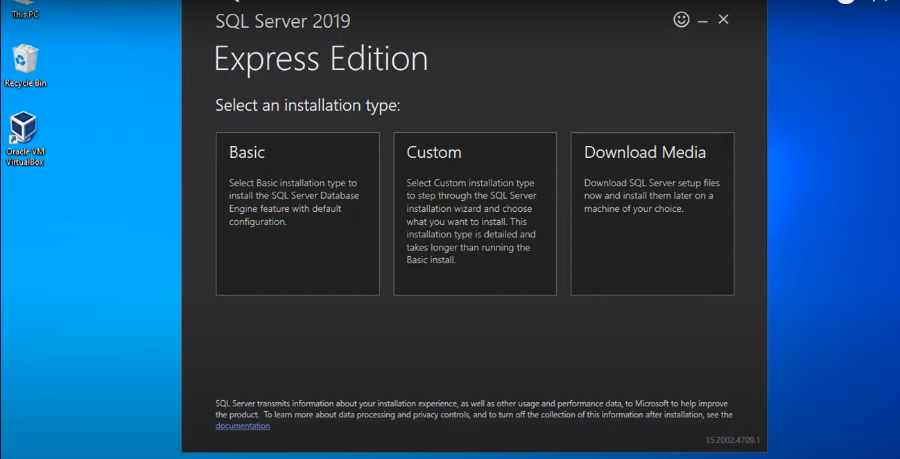
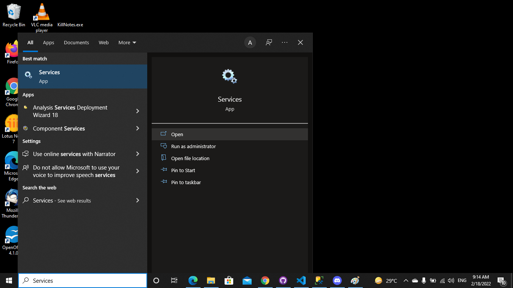
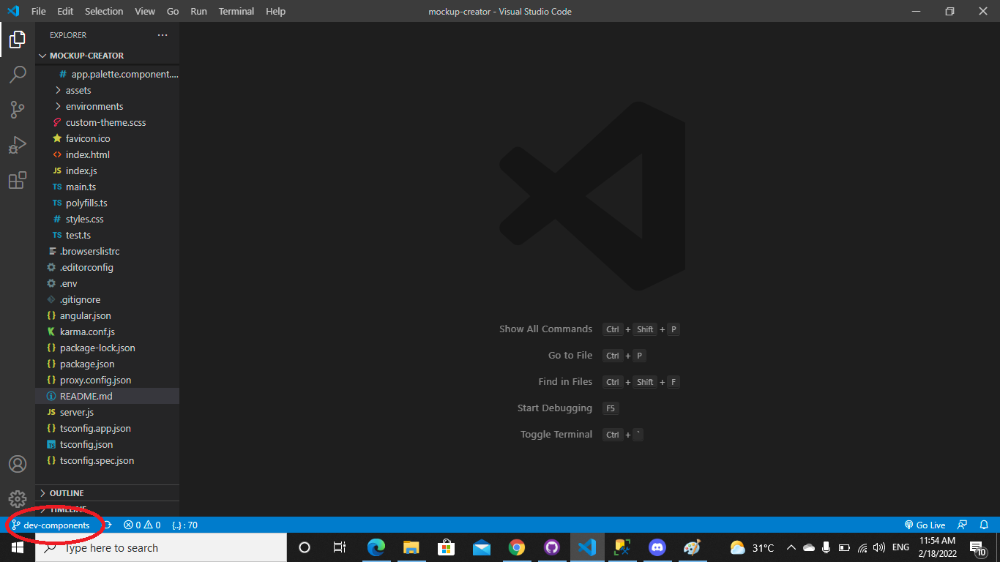

# MockupCreator

This project was generated with [Angular CLI](https://github.com/angular/angular-cli) version 13.0.3.

## Development server

Run `ng serve` for a dev server. Navigate to `http://localhost:4200/`. The app will automatically reload if you change any of the source files.

## Code scaffolding

Run `ng generate component component-name` to generate a new component. You can also use `ng generate directive|pipe|service|class|guard|interface|enum|module`.

## Build

Run `ng build` to build the project. The build artifacts will be stored in the `dist/` directory.

## Running unit tests

Run `ng test` to execute the unit tests via [Karma](https://karma-runner.github.io).

## Running end-to-end tests

Run `ng e2e` to execute the end-to-end tests via a platform of your choice. To use this command, you need to first add a package that implements end-to-end testing capabilities.

## Further help

To get more help on the Angular CLI use `ng help` or go check out the [Angular CLI Overview and Command Reference](https://angular.io/cli) page.

## MockupCreator: How it works

This project allows you to create a MockUp for easier website creation. The main page of the creation tool consists of 3 main elements: The `Palette`, The `Canvas` and the `Component Properties`.

## Features

`Canvas` - as its name suggests, the canvas is where the elements of the `Palette` will be placed.

`Component Properties` - the user has the ability to change the component properties of the elements that are dragged inside the canvas, they can modify the `Component ID`, `value`, `dragability`, `class`, `CSS`, & `Style`. You can also find the `Position of the elements` (X & Y) under the `Properties Tab`. You can also remove the selected element inside the canvas by pressing the `Remove` button under the `Properties Tab`. 

In the `Code` tab, you have the different functionalities:

Copy: Copies the code generated by the tool in the user's clipboard.

Download: Downloads the HTML File of the Mockup.

Build: Opens a new tab that previews the Mockup.

`Palette` - Under the palette, we have 2 tabs which composes of the Elements and Templates. The elements are the components that can be dragged into the canvas. The Template is a ready-built page to guide the users in creation of their Mockup.

Elements:

`Navbar`: A navigation bar is a component of a website's user interface that contains links to other sections of the website.

`Link`: When you click on a Link, you can jump to a different location. A link can be an image or any other HTML element.

`Header`: A header is commonly used as a 'top section' of a web page.

`Paragraph`: A paragraph is a group of sentences that forms a specific topic.

`Label`: A label is a component used to define a caption for an element in an HTML

`Button`: A button is a component that is clickable. It can be used for various funcionality depending on the user.

`Dropdown`: When clicked, a drop-down menu drops down a menu that contains different options.

`Checkbox`: The check box is shown as a component that is ticked (checked) when activated.

`Radio Button`: The radio button is a control element that allows the user to select only one of a set of mutually excluseive possibilities that have been pre-defined.

`Input Field`: An input field is used for storing text inputs. The input field can only accept a limited number of text inputs.

`Text Box`: Similar to the input field, a text box is also used for storing text inputs. The text box usually accepts a larger amount of text inputs than the input field.

`Date Picker`: A date picker is a popup calender that allows the user to select a specific date.

`Modal`: A modal is an element that display in front of the page and deactivates other page content unless a specific action is made (e.g. Clicking OK, Filling out a form, Clicking Cancel)

`Image`: The image component lets the user insert an image inside the canvas

`Table`: The table component lets the user insert a table inside the canvas with a specific number of rows and columns.

`Iframe`: An Iframe is a component that can be embedded inside the canvas and is often used to insert content.

## Installation and Setting Up the Database

The following are the steps to installation and setting-up the database:

###### Installation of Microsoft SQL 2019 on Windows10: 

1.Download MS SQL 2019 Express edition on this website https://www.microsoft.com/en-in/sql-server/sql-server-downloads

2.Run the downloaded app, select "Basic" installation type.

3.Click "Accept" then "Install".

4.Once done, click "Connect Now" to check if MSSQL is installed correctly. If the version is visible on CMD, then it's installed correctly. Then close the CMD.

5.Click "Install SSMS" and you will be redirected to their website.

6.On their website, click "Download SQL Server Management Studio (SSMS)"

7.Run the downloaded SSMS then click "Install"

8.Once Setup is completed, click "Close" and close all open tabs.

9.Open Microsoft SQL Server Management Studio on your computer. Select "Windows Authentication" on Authentication then click "Connect".

###### Database Set-up and creation of new log in.

1.Click "New Query". Create “mockupdb” Database by running the command below, then click "Execute":

     	CREATE DATABASE mockupdb;

2.On your Query, delete the previous command then create LOGIN using “mockuser” as username and “Awsol12#”  as PASSWORD by running the command below. Then click "Execute".

    USE master;
    GO
  	CREATE LOGIN mockuser WITH PASSWORD = 'Awsol12#';
  	GO

  	USE [mockupdb]
  	GO
  	CREATE USER mockuser FOR LOGIN mockuser;
  	GO
  	EXEC sp_addrolemember N'db_owner', N'mockuser';
    GO

3.On your Query again, delete the previous command then create “Users” TABLE by running the command below. Then click "Execute".

        CREATE TABLE Users (
    	UserID int IDENTITY(1,1) PRIMARY KEY,
    	UserName varchar(255) NOT NULL UNIQUE,
    	Password varchar(255) NOT NULL,
   	FirstName varchar(255) NOT NULL,
   	LastName varchar(255) NOT NULL,
   	Email varchar(255) NOT NULL UNIQUE,
    );

4.On your Query again, delete the previous command then insert a record in Users table by running the command below, and click "Execute".

	INSERT INTO Users(UserName, Password, FirstName, LastName, Email) VALUES (
    
    'mmiller0001',
    'password',
    'Mike',
    'Miller',
    'mike.miller2021@gmail.com'
    );

5.Close your Query tab and click "Yes" to save the changes.

6.On the left side of your MS SQL screen under "Object Explorer", right click on your server name and click "Properties". Click "Security" and set security property of Server to "SQL Server and Windows Authentication mode" then click "OK". Right click on your server name again and click "Restart". Then click "Yes".

7.Once restarting is done, click the Plugin icon to login your server with the credentials created.

    - Set Authentication to "SQL Server Authenticaton"
    - Input Login "mockuser" and Password "Awsol12#"
    - Click "Connect"

###### Connection to Server

1.On your windows search bar, search for "SQL Server 2019 Configuration Manager". Click "Open".

2.Expand "SQL Server Network Configuration" and click "Protocols for SQL Express"

3.Right click on TCP/IP and click Enable.

4.Right click on TCP/IP again and click Properties.

5.Go to IP Addresses.On the bottom part, set IPAll TCP PORT to 1433. Click "Apply" then "OK". 

6.Click "OK" to close TCP/IP Properties then close "SQL Server 2019 Configuration Manager".

7.On your windows search bar again, search for "Services" then click "Open" 

8.Right click on SQL Server(SQLEXPRESS) and click Restart. Once done, close the Services tab.

9.On dev-components branch, open the project on Visual Studio Code.

10.On your VS Code, click "Terminal" then "New Terminal" 

11.On your terminal, run "npm install" to install the dependencies.

12.Once installation is done, run "ng serve" on your terminal. Once compiled succesfully, open your browser and go to http://localhost:4200/ to open your app. 

13.Go back to your VS Code and open another terminal.

14.On new terminal run "node server.js" to run the server.

15.On your browser, login your Users data on your angular app.

    - Username: "mmiller0001"
    - Password: "password"

## Known bugs

## Areas of Improvement

## Mockup Creation Tool Developers

This Mockup Creation Tool is developed by the following trainees with the help of their OJT SVs: Sir `Leo Tulabot` and Sir `Reynie Mahilum`.

    B35A Manila Trainees:
    - Juan Paolo Bandong (Jupao)
    - Rio Jude Emmanoel Bontigao (Jude)
    - Markiel Imperial (Mark)
    - Philip Mhey Jaico (Phil)
    - Ismael Lanada III (Mikmik)
    - Ralph Vincent Sicat (Raven)

    B35A Cebu Trainees:
    - Meryll Avanceña (Meryll)
    - VJ Marlo Concha (VJ)
    - James Wilmer Lim (James)

    B35B Manila Trainees:
    - Stephen Caña (Stip)
    - Arthur Espartinez (Art)
    - Jesu Romas Nuevarez (Jes)
    
    B35B Cebu Trainee:
    - Jesu Jomari Lacastesantos (Jay)
